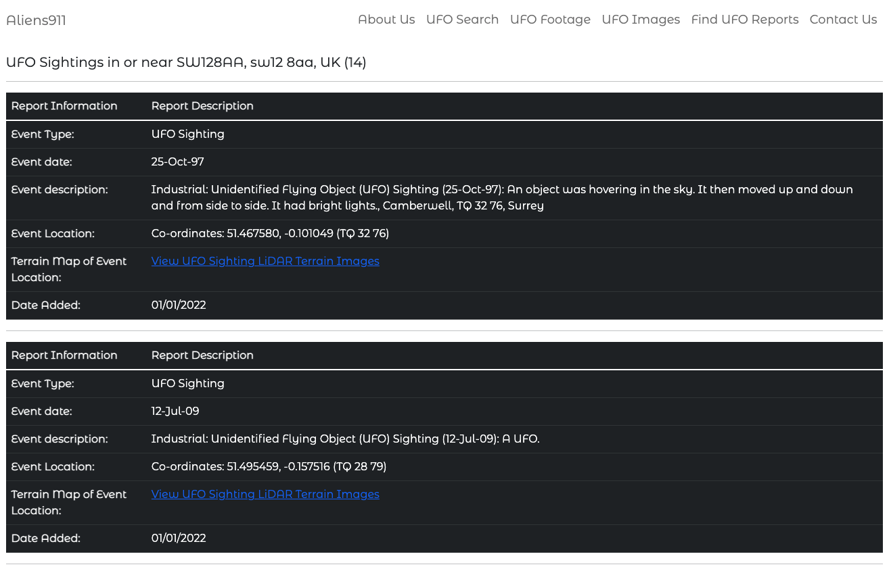
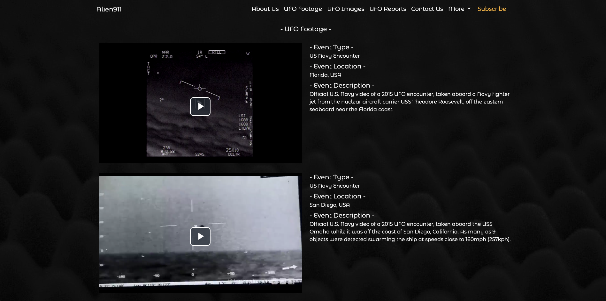

 

# **Aliens911 - Database of recorded UFO phenomenon**

## **Introduction**

Aliens 911 is a database of Unidentified Flying Object (UFO) sightings. We are starting with British UFO sightings data from the UK's Ministry of defense's (MOD). Here you'll see distribution maps of those sightings in England, Scotland or Wales. We're currently working on the worldwide data and it will be coming soon!

## **Table of contents** 

### **1. User Experience (UX)**
  * 1.1 Target audience
  * 1.2 Visitor goals
  * 1.3 Business goals
  * 1.4 User stories
  * 1.5 Design choices
  * 1.6 Wire frames

### **2. Features**
  * 2.1 The Navbar
  * 2.2 The Footer
  * 2.3 The Homepage
  * 2.4 Search Results 
  * 2.5 About Us
  * 2.6 UFO Footage
  * 2.7 UFO Images
  * 2.8 UFO Reports
  * 2.9 Contact Us
  * 2.10 More
  * 2.11 Subscribe
  * 2.12 Features Left To Implement

### **3. Technologies/Languages Used**
  * 3.1 VSCode
  * 3.2 HTML5
  * 3.3 CSS
  * 3.4 JavaScript
  * 3.5 Bootstrap (Version 5)
  * 3.6 Google fonts 
  * 3.7 Font Awesome 
  * 3.8 Pearl
  * 3.9 Video JS
  * 3.10 Balsamiq

### **4. Testing**
  * 4.1 See [testing.md](testing.md) document 

### **5. Deployment**

  * 5.1 Deployment 
  * 5.2 Cloning 
  * 5.3 Cloning Desktop

### **6. Credits**
  * 6.1 Media
  * 6.2 Code

### **7. Contact**
  * 7.1 LinkedIn
  * 7.2 Email
  * 7.3 Skype

### **8. Disclaimer**

  * 8.1 Disclaimer on project 
___

## **1. User Experience (UX)**

### **1.1 Target Audience**

####  This website is aimed at anyone who:

* Is interested in reading information on recorded UFO phenomenon, viewing UFO images or watching UFO Video footage. 

### **1.2 Visitor goals** 

* To be able to to search for recorded UFO phenomenon by a particular geographical area (currently limited to the UK). I also want to be able to view the UFO Images, the UFO Footage, read the free to read UFO reports, sign up for a paid subscription and to contact the site admin if needed.  

### **1.3 Business goals**

* The site provides some information for free to users, however to access all of the 7,000+ recorded files users are required to have paid subscription. The business goal of the site is to drive paid subscriptions.

### **1.4 User Stories**

As a visitor to the company website i expect/want/need

### **1.5 Design choices** 

* I wanted the project to have a serious feel and to be credible. We are using official data from the British Ministry of Defense (MoD) and we wanted the design choices to reflect the credibility of the site. I wanted to use lots of great imagery throughout the site so it gave a positive user experience. I didn't want lots of clutter on the pages as this can be common with websites of this type. The site also had to be easy to navigate.

#### FONTS

* I decided i would use the Google font [Montserrat Alternates](https://fonts.google.com/specimen/Montserrat+Alternates?query=Montserrat+Alternates&preview.text=This%20is%20how%20the%20font%20is%20displayed&preview.text_type=custom) for this project. I chose this font as it is a modern font and has that clean minimalist look i wanted. It looks well on both mobile and desktop devices. 

#### ICONS

* The majority of the icons i have used on the site have come from [Font Awesome](https://fontawesome.com/) I made use of icons because they make a site look better and also give the user an idea of the type of information that they are looking at.

#### COLORS

* The bulk of the site is made up of full page background imagery. This was done intentionally so each page has its own feel without needing to do a lot of CSS to achieve this. The colors that we did use throughout the site were:

1. Black 

2. White 

3. Grey 

### **1.6 Wire Frames** 

<!-- Need to add these -->
[Homepage Desktop]() 
[Homepage Mobile & iPad]() 
[About Us Desktop]() 
[About Us Mobile & iPad]() 
[Cleaning Services Desktop]() 
[Cleaning Services Mobile & iPad]() 
[Our Promise Desktop]() 
[Our Promise Mobile & iPad]() 
[FAQ Desktop]() 
[FAQ Mobile & iPad]() 
[Contact Us Desktop]() 
[Contact Us Mobile & iPad]()
___
## **2. Features**

### **2.1 The Navbar**

* The Navbar i used is a standard Bootstrap 5 Navbar. The menu items in the Navbar may change over time, but the current ones we have are: 

1. About Us
2. UFO Footage 
3. UFO Images 
4. UFO Reports
5. Contact Us
6. More (A drop down menu which contains the F.A.Q page and the Terms of Use page)
7. Subscribe 

* The site also needed to be mobile responsive, this is the main reason i chose Bootstrap for this project as it provided me with a quick and easy way of achieving this. On smaller screen sizes the navbar will collapse into a hamburger menu that when clicked will expand and reveal the nav bar items. 

### **2.2 The Footer** 

* The footer is a standard basic footer that just lists the copyright to ARCHI Information Systems and also lists myself as the developer. 

### **2.3 The Homepage**

* The homepage is where you will find the main search engine for the site. Here users can enter any geographical location in the UK to perform a search. The ARCHI UK search engine will then deliver all of the results on a new page. The results displayed will be capped to within a specified radius of the original geographical search area. 

* The search bar

### **2.4 Search Results**

* When a user searches on the homepage using a geographical location, the ARCHI UK search engine will process that search result and return a list of search results to the user. The search results are displayed on a new page using the same template with a summary of each event. The summary displayed will contain:

1. Event Type
2. Event Date
3. Event description (Short summary)
4. Event location (co-ordinates)
5. Link to a LIDAR map where event took place
6. Date the event was added to the database 

* The search results displayed will also be limited to within a certain distance from the original search location. So if a user searches for the postcode SW12 8AA, then the search results will be limited to all results within a specific kilometer distance from this area.

* Also the number of results a user can read for free will be limited, only members with a paid up subscription will be able to access all of the reports without restriction. 

### **2.5 About Us**

* The about us page has a background image of a man shining a torch into the sky and some text giving information about the site. 

### **2.6 UFO Footage**

* This page has a gallery of uploaded UFO Footage for users to view. The video player i used for this was [VideoJS](https://videojs.com/) Users are also able to watch the video in thumbnail size, full screen, and as a pop out video where they can watch a certain piece of footage while continuing to scroll at the same time.

* Picture in picture active 

### **2.7 UFO Images**

* This page has a gallery of uploaded UFO Images from various sources. The gallery will display images as cards with a title and a short description. Users can click on an image to enlarge it, once the image is full screen the user can then scroll through the images one by one. The cards are also responsive and the layout will change depending on the users screen size. 

* Image in full screen/expanded mode 

* Image page in tablet size 

* Image page in mobile size 

### **2.8 UFO Reports**

* This page will have a selection of free to read UFO reports. The reports are all displayed in the exact same format displaying a summary of each report. Users will be able to click into each report and read it in more detail. 

* Users can purchase a paid subscription to access all 7,000+ reports. 

### **2.9 Contact Us**

* The contact us page has a contact form where users can contact the site admin. The fields on the form are: 

1. The users name - `<input type="text">`
2. The users email `<input type="email">`
3. The users message `<textarea>`
4. Send button 

### **2.10 More**

* The more dropdown menu contains 2 pages at the moment. They are the F.A.Q page and the Terms of Use page

* The FAQ page has an image instructing the user to scroll down to read the FAQ's

 

* FAQ page text displayed

 

* The Terms of Use page has an image instructing the user to scroll down to read the Terms of Use

 

* Terms of Use page text displayed

 

### **2.11 Subscribe**

* Users can purchase an annual subscription to ARCHI UK on this page.

### **2.11 Features Left To Implement**
___

## **3. Technologies/Languages Used**

3.1 [VS Code](https://code.visualstudio.com/) - I used Visual Studio Code for all of the coding i did during the project 
3.2 [HTML5](https://html.com/html5/#What_is_HTML) - The markup language used for this project. 
3.3 [CSS](https://en.wikipedia.org/wiki/CSS) - I used CSS to help alter and adjust the presentation of the website to create a pleasant user experience. 
3.4 [JavaScript](https://en.wikipedia.org/wiki/JavaScript) - JavaScript often abbreviated as JS, is a programming language that conforms to the ECMAScript specification. Alongside HTML and CSS, JavaScript is one of the core technologies of the World Wide Web. 
3.5 [Bootstrap 5](https://getbootstrap.com/) - Bootstrap is the most popular CSS Framework for developing responsive and mobile-first websites. Bootstrap 5 is the version i used for the development of this project. 
3.6 [Google fonts](https://fonts.google.com/) - A library of 1,023 free licensed font families for developers to choose from. 
3.7 [Font Awesome](https://fontawesome.com/) - A library of 1,600+ free to use icons that can be customized even further with CSS 
3.8 [Pearl](https://www.perl.org/) - Pearl is a highly capable, feature-rich programming language with over 30 years of development. 
3.9 [VideoJS](https://videojs.com/) - VideoJS is a web video player built from the ground up for an HTML5 world. It supports HTML5 video and modern streaming formats, as well as YouTube, Vimeo, and even Flash (through plugins, more on that later). It supports video playback on desktop and mobile devices. 
3.10 [Balsamiq](https://balsamiq.com/wireframes/?gclid=CjwKCAiAi_D_BRApEiwASslbJ_NXgCJLhWQ06W9sA_HcnQ4agJM5EJa4wWRNrXu6oJbIoz_zaiVBaRoCAScQAvD_BwE)- Balsamiq Wireframes is a rapid low-fidelity UI wireframing tool that reproduces the experience of sketching on a notepad or whiteboard. Used for producing the wire frames for this project. 
___
## **4. Testing**

* Testing information can be found in the [testing.md](testing.md) file
___

## **5. Deployment**

### **5.1 Deployment**  

* The site is currently deployed on ARCHI UK servers. The link to the published site can be found by clicking here [Aliens911.com](https://www.aliens911.com/)

### **5.2 Cloning**

* You can clone the projects repository to your local computer by following the steps below:

Cloning a repository using the command line

1. On github navigate to the project repository. The link can be found here: https://github.com/smcgdub/alliens911
2. Click on the tab that says < >code 
3. Above the files, click the button that says &#8595;code

4. From the menu select HTTPS
5. Click on the clipboard icon on the right hand side (Image below)

6. Open the terminal in your IDE
7. Change the current working directory to the location where you want the cloned directory.
8. In terminal type `git clone` and then paste the URL you copied earlier 
https://github.com/smcgdub/alliens911
9. Press Enter to create your local clone.

### **5.3 Cloning To Desktop**
You can also clone the project from Github direct to your Desktop. To do this you can do the following: 

1. On github navigate to the projects repository. The link can be found here: https://github.com/smcgdub/alliens911
2. Click on the tab that says < >code 
3. From the dropdown menu select the option DownloadZip
4. The zipped file will now download to your desktop, drag and drop this unzipped file to your IDE and you can open the project. 
___

## **6. Credits** 

### **6.1 Media** 

* Image on the homepage credit goes to [Thanh Nguyen](https://unsplash.com/@flousentimental). Link to the image is [Here](https://unsplash.com/photos/XZj8Z6Elmz4) 
* Image on the About Us page credit goes to Martin Sattler 
* Image on the UFO Footage credit goes to [Niek Doup](https://unsplash.com/@niekdoup). Link to the image is [Here](https://unsplash.com/photos/OuuMTjwEP-o) 
* Image on the UFO Images, FAQ and Terms of Use page credit goes to [Peter Gargiulo](https://unsplash.com/@grndezyns). Link to the image is [Here](https://unsplash.com/photos/cGNCepznaV8) 
* Image on the Contact Us page credit goes to [Dave Hoefler](https://unsplash.com/@davehoefler). Link to the image is [Here](https://unsplash.com/photos/rcE3_D-u2NE) 

### **6.2 Code** 

* Majority of the code used was Bootstrap. Their [main documentation](https://getbootstrap.com/docs/5.0/getting-started/introduction/) has most of the information you need for using the framework.
___

## **7. Contact Me**

Feel free to contact me on any of the following channels: 

* 7.1 [LinkedIn](https://www.linkedin.com/in/stephenmcgovern01/) 
* 7.2 [Email](mailto:smcgdub@gmail.com) 
* 7.3 [Skype](https://join.skype.com/invite/ndruMu7qVuKZ)
* 7.4 [My Portfolio Page](https://stephens-portfolio.com/)

___
## **8. Disclaimer**  

>